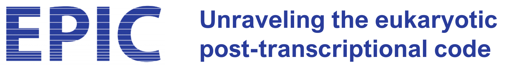
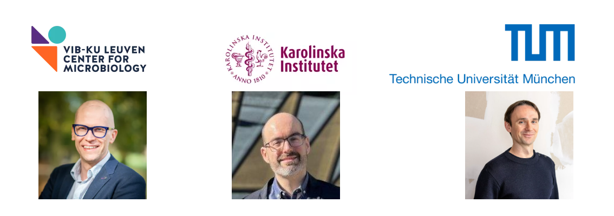
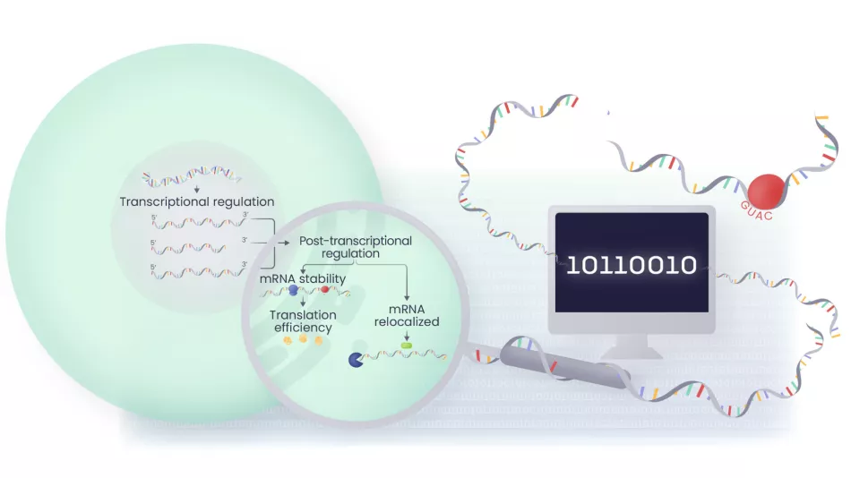
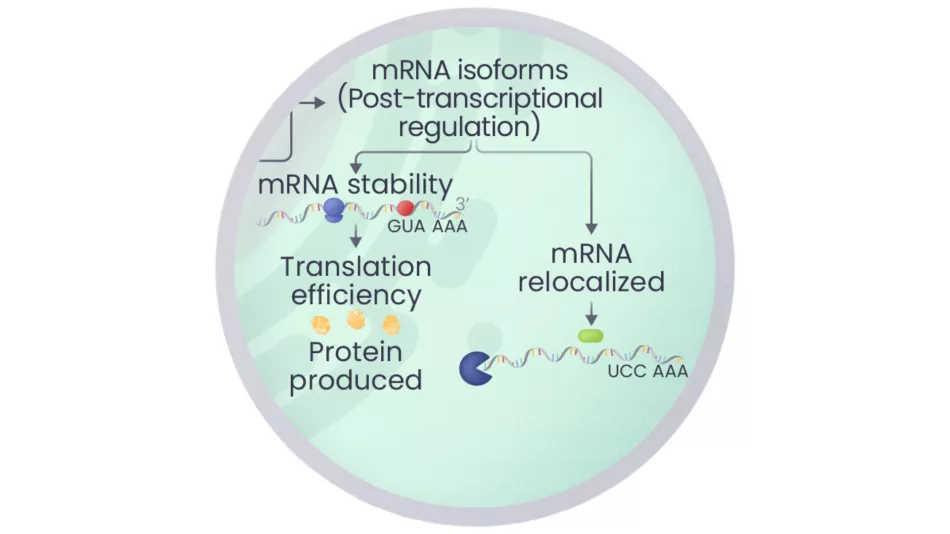
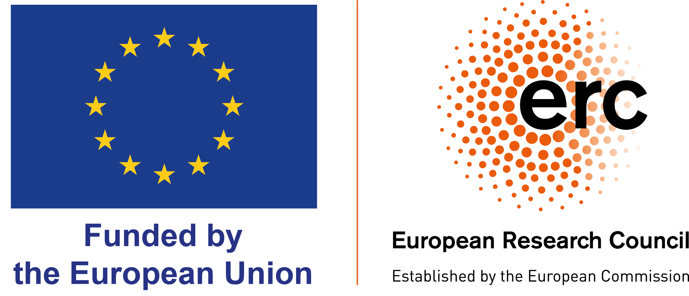

---

## About EPIC  
Three leading laboratories in **Belgium (Verstrepen Lab)**, **Germany (Gagneur Lab)**, and **Sweden (Pelechano Lab)** combine cutting-edge expertise and technologies to map all levels of gene regulation. Our goal is to develop the first comprehensive model of the eukaryotic regulatory code — from **DNA sequence to protein abundance**.

---

## Post-transcriptional Regulation: Crucial but Understudied  
Genomes encode instructions for cells to regulate gene activity in response to environmental changes. Gene regulation consists of two major steps:

1. **Transcription**: Genes are transcribed into mRNA.  
2. **Post-transcriptional Regulation**: Mechanisms control mRNA stability and the rate of translation into proteins.  

This second step remains poorly understood because key parameters — such as **mRNA half-life**, **protein binding**, and **subcellular localisation** — are difficult to measure.  
By combining the expertise of three European research teams, **EPIC** will shed light on these mechanisms.

---

## Unravelling the Complete Regulatory Code  
In EPIC, we leverage the advantages of the model eukaryote **Saccharomyces cerevisiae** and other species spanning a broad evolutionary range to derive the first **sequence-based model of eukaryotic gene regulation**.  

Our approach combines:  
- **High-throughput technologies** to probe post-transcriptional regulation at unprecedented scale across species and conditions.  
- **Synthetic biology** to massively test regulatory sequences.  
- **Deep learning** to build predictive models and decode complex regulatory instructions.  

Ultimately, these insights will not only help us understand the regulatory code but also enable the design of **new regulatory modules tailored to specific applications**.

---

## Additional Information  
🔗 [Visit our website](https://ercsynergy-epic.eu/en)

  
*Funded by the European Union – European Research Council (ERC)*

---
